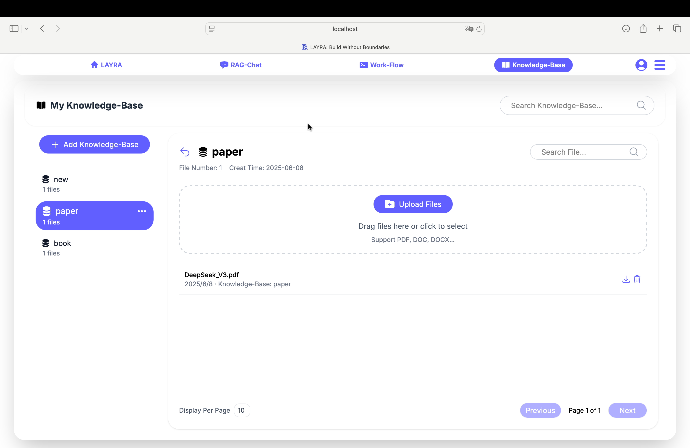
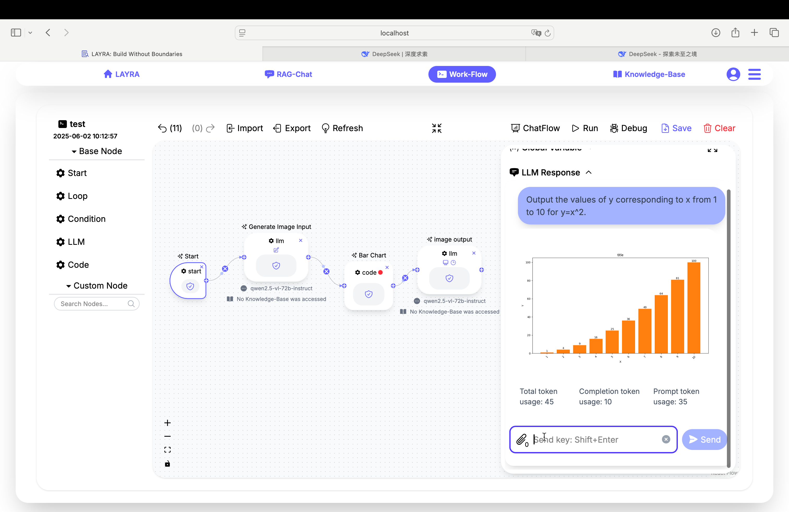
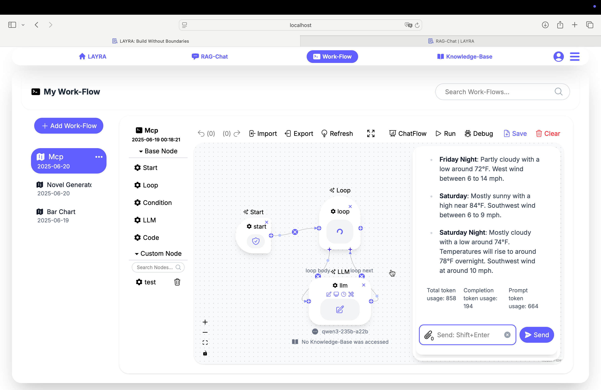

<div align="center">
  
  <h1>🌌 LAYRA：视觉优先的Agent工作流引擎：构建无限可能！</h1>
  <p>
    <a href="https://github.com/liweiphys/layra/stargazers">
      
    </a>
    <a href="https://github.com/liweiphys/layra/blob/main/LICENSE">
      
    </a>
    <a href="https://github.com/liweiphys/layra/issues">
      
    </a>
    <a href="https://liweiphys.github.io/layra">
      
    </a>
  </p>
  <p>
    <a href="./README.md">English</a> |
    <a href="./README_zh.md">简体中文</a>
  </p>
</div>

<div align="center">
  <!-- 折叠式群组面板 -->
  <details open>
    <summary>📢 点击展开微信交流群</summary>
    <div style="display: flex; flex-wrap: wrap; justify-content: center; gap: 15px; margin-top: 10px;">
      <div style="text-align: center;">
        <p>🚀 用户交流群1</p>
        
      </div>
      <div style="text-align: center;">
              <p>💡 微信公众号</p>
        
      </div>
    </div>
  </details>
</div>

---

**LAYRA** 是全球首个“视觉原生”的 AI 自动化引擎。它能**像人类一样阅读文档**，保留布局和图形元素，并通过完整的 Python 控制执行**任意复杂的工作流**。从视觉驱动的检索增强生成（RAG）到多步骤智能体工作流编排，LAYRA 助您构建下一代智能系统——无限制，无妥协。

专为**企业级部署**而构建，LAYRA 具备以下特性：

- **🧑‍💻 现代化前端：** 基于 Next.js 15 (TypeScript) 和 TailwindCSS 4.0 构建，提供响应迅捷、开发者友好的用户界面。
- **⚡ 高性能后端：** 基于 FastAPI， 集成全异步 Redis、MySQL、MongoDB、Kafka 和 MinIO——专为高并发设计。
- **🎯 视觉原生文档理解：** 利用 ColQwen2.5 将文档转换为语义向量，并存储于 Milvus 向量数据库中。
- **🚀 强大的工作流引擎：** 可构建复杂、循环嵌套且可调试的工作流，具备完整的 Python 执行能力和人机协同（Human-in-the-loop）功能。

---

## 📚 目录

- [🚀 快速开始](#快速开始)
- [📖 教程](#教程)
- [❓ 为什么选择 LAYRA？](#为什么选择layra)
- [⚡️ 核心超能力](#核心超能力)
- [🚀 最新更新](#最新更新)
- [🖼️ LAYRA 截图](#截图)
- [🧠 系统架构](#系统架构)
- [🧰 技术栈](#技术栈)
- [⚙️ 部署指南](#部署指南)
- [📦 Roadmap](#Roadmap)
- [🤝 贡献指南](#贡献指南)
- [📫 联系我们](#联系我们)
- [🌟 Star History](#Star-History)
- [📄 许可证](#许可证)

---

<h2 id="快速开始">🚀 快速开始</h2>

#### 📋 前置条件

开始前请确保系统满足：

1. 已安装 **Docker** 和 **Docker Compose**
2. 已配置 **NVIDIA Container Toolkit**（GPU 加速所需）

#### ⚙️ 安装步骤

##### 1. 配置环境变量

```bash
# 克隆仓库
git clone https://github.com/liweiphys/layra.git
cd layra

# 编辑配置文件（按需修改服务器IP/参数）
vim .env

# 关键配置项包括：
# - SERVER_IP（服务器IP）
# - MODEL_BASE_URL（模型下载源）
```

##### 2. 构建并启动服务

```bash
# 首次启动将下载约15GB模型（请耐心等待）
docker compose up -d --build

# 实时监控日志（将<container_name>替换为实际容器名）
docker compose logs -f <container_name>
```

> **注意**：如果 `docker compose` 遇到问题，尝试使用 `docker-compose`。同时，确保你使用的是 Docker Compose v2，旧版本不被 LAYRA 支持。你可以通过 `docker compose version` 或 `docker-compose version` 来检查当前版本。

#### 🎉 开始使用！

所有服务运行正常后，即可使用 LAYRA 进行开发！🚀✨  
_详细选项请参阅[部署指南](#部署指南)_

> **📘 重要提示：** 我们强烈建议在开始使用 LAYRA 前花 10 分钟学习[教程](https://liweiphys.github.io/layra) - **这小小的投入将帮助您掌握 LAYRA 的全部潜力**，解锁各项高级功能。

---

<h2 id="教程">📖 教程</h2>
官方的详细教程请访问我们的 GitHub Pages:

[官方教程](https://liweiphys.github.io/layra)

> **🚀 快速更新!**  
> 我们的教程在快速更新中!

---

<h2 id="为什么选择layra">❓ 为什么选择LAYRA？</h2>

### 🚀 超越 RAG：视觉优先工作流的力量

LAYRA 的**视觉 RAG 引擎**革新了文档理解能力，但其真正威力在于**智能体工作流引擎**—一个视觉原生平台，用于构建能看、能推理、能行动的复杂 AI 智能体。与传统 RAG/Workflow 系统不同，LAYRA 通过以下特性实现全栈自动化：

### ⚙️ 高级工作流能力

- **🔄 循环与嵌套结构**  
  构建包含嵌套循环、条件分支等 Python 自定义逻辑的工作流——无结构限制
- **🐞 节点级调试**  
  通过可视化断点调试检查变量、暂停/恢复执行、修改状态
- **👤 人机协同集成**  
  在关键节点注入人工审批实现 AI-人类协作决策
- **🧠 会话记忆与 MCP 集成**  
  通过会话记忆保持跨节点上下文，通过模型上下文协议（MCP）访问外部信息
- **🐍 完整 Python 执行**  
  在沙箱环境中运行任意 Python 代码（支持`pip`安装、HTTP 请求等）
- **🎭 多模态 I/O 编排**  
  工作流支持文本/图像混合的多模态输入输出

### 🔍 视觉 RAG：视觉感知引擎

传统 RAG 系统的缺陷：

- ❌ **丢失布局信息**（列、表格、层级结构）
- ❌ **无法处理非文本视觉元素**（图表、图示、图形）
- ❌ **因 OCR 分割问题破坏语义连续性**

**LAYRA 通过纯视觉嵌入彻底改变这一现状：**

> 🔍 它像人类一样整体阅读页面，完整保留：
>
> - ✅ 布局结构（标题、列表、章节）
> - ✅ 表格完整性（行、列、合并单元格）
> - ✅ 嵌入式视觉元素（图表、图形、印章、手写体）
> - ✅ 布局与内容的多模态一致性

**两大引擎共同构成首个完整的视觉原生智能体平台——AI 不仅能检索信息，更能端到端执行复杂的视觉驱动工作流。**

---

<h2 id="核心超能力">⚡️ 核心超能力</h2>

### 🔥 **智能体工作流引擎：无限制执行智能**

> **无限制编码，无边界构建**  
> 我们的引擎用 LLM 思考，用视觉感知，用 Python 构建逻辑——无限制，纯智能。

- **🔄 无限制工作流创建**  
  通过直观界面设计复杂自定义工作流，**无结构约束**处理业务逻辑、分支、循环和条件
- **⚡ 实时流式执行（SSE）**  
  **实时观察**执行结果流，彻底消除等待时间
- **👥 人机协同集成**  
  在关键决策点**集成人工输入**进行审查、调整或引导模型推理
- **👁️ 视觉优先多模态 RAG**  
  采用 LAYRA 专利**纯视觉嵌入系统**，在**50+格式**（PDF/DOCX/XLSX/PPTX 等）中实现无损文档理解
- **🧠 会话记忆与 MCP 集成**
  - **MCP 集成** 访问超越原生上下文窗口的实时动态信息
  - **会话记忆** 通过会话记忆保持上下文连续性
- **🐍 全栈 Python 控制**
  - 用**任意 Python 表达式**驱动逻辑（条件、循环等）
  - 在节点中执行**无限制 Python 代码**（HTTP 请求/AI 调用/绘图等）
  - 支持安全`pip`安装的**沙箱环境**，并对环境持久化
- **🎨 灵活多模态 I/O**  
  处理和生成文本/图像/混合的多模态输出
- **🔧 高级开发套件**
  - **断点调试**：执行中检查工作流状态
  - **可复用组件**：导入/导出工作流
  - **嵌套逻辑**：构建深度动态任务链
- **🧩 智能数据工具**
  - 从 LLM 输出提取变量
  - 动态解析 LLM 的 JSON 格式
  - 模板渲染引擎

### 👁️ 视觉 RAG 引擎：超越文本，超越 OCR

> **忘记分词，忘记布局丢失**  
> 通过纯视觉嵌入，LAYRA 像人类一样理解文档——逐页保留完整结构。

**LAYRA**采用新一代**纯视觉嵌入技术**驱动的检索增强生成（RAG）系统。它将文档视为视觉结构化产物而非字符序列——完整保留布局、语义及表格/图形/图表等视觉元素。

---

<h2 id="最新更新">🚀 最新更新</h2>

**(2025.6.2) 工作流引擎正式发布**：

- **断点调试**：通过暂停/恢复功能交互式调试工作流
- **无限制 Python 定制**：执行任意 Python 代码（包括`pip`依赖安装,`requests`获取外部`http`请求）
- **嵌套循环与 Python 条件**：构建含循环嵌套和 Python 条件逻辑的复杂工作流
- **LLM 集成**：
  - 自动 JSON 解析输出结构化响应
  - 跨节点会话记忆
  - 支持**50+格式**的多模态 RAG 文件上传与知识库检索

**(2025.4.6) 首个试用版发布**：  
 LAYRA 首个可测试版本上线！用户可上传 PDF 文档、提问并获取保留布局的答案。

- **当前功能**：
  - PDF 批量上传与解析
  - 视觉优先的检索增强生成（RAG）文档查询
  - 后端采用**FastAPI/Milvus/Redis/MongoDB/MinIO**全栈优化

敬请期待更多更新！

---

<h2 id="截图">🖼️ LAYRA截图</h2>

- ##### LAYRA 的网页设计始终秉持简约理念，使其更易于新用户上手。

通过以下这些截图展示，探索 LAYRA 简约的界面和功能

1. **首页 - LAYRA 入口**  
   

2. **知识库 - 集中式文档中心**  
   

3. **交互对话 - 保留布局的答案**  
   

4. **工作流构建器 - 拖拽式智能体创建**  
   

5. **工作流构建器 - MCP 获取天气案例**  
   
   

---

<h2 id="系统架构">🧠 系统架构</h2>

LAYRA 的管道设计遵循**异步优先**、**视觉原生**和**可扩展的文档检索与生成**原则。

### 🔍 查询流程

查询经嵌入 → 向量检索 → 答案生成：


### 📤 上传与索引流程

PDF 解析为图像 →ColQwen2.5 视觉嵌入 → 元数据/文件存储：


### 📤 工作流执行（Chatflow）

**事件驱动**的**有状态调试**流程：

1. **触发与调试控制**
   - Web UI 提交含**可配置断点**的工作流
   - 后端执行前验证工作流 DAG
2. **异步编排**
   - Kafka 检查**预定义断点**并触发暂停通知
   - 扫描器执行**AST 代码分析**与漏洞检测
3. **安全执行**
   - 沙箱启动带文件隔离的临时容器
   - 运行时状态快照持久化至*Redis/MongoDB*
4. **可观测性**
   - 执行指标通过 SSE 实时流式传输
   - 用户通过调试控制台注入测试输入
     

---

<h2 id="技术栈">🧰 技术栈</h2>

**前端**：
`Next.js`, `TypeScript`, `TailwindCSS`, `Zustand`, `xyflow`

**后端与基础设施**：
`FastAPI`, `Kafka`, `Redis`, `MySQL`, `MongoDB`, `MinIO`, `Milvus`, `Docker`

**模型与 RAG**：

- 嵌入模型：`colqwen2.5-v0.2`
- LLM 服务：`Qwen2.5-VL系列（或任意OpenAI兼容模型）`
  [本地部署注意事项](https://liweiphys.github.io/layra/docs/RAG-Chat)

---

<h2 id="部署指南">⚙️ 部署指南</h2>

#### 📋 前提条件

1. 已安装 **Docker** 和 **Docker Compose**
2. 已配置 **NVIDIA Container Toolkit**

#### ⚙️ 安装步骤

##### 1. 配置环境变量

```bash
git clone https://github.com/liweiphys/layra.git
cd layra
vim .env  # 修改SERVER_IP等参数
```

##### 2. 构建并启动

```bash
docker compose up -d --build  # 首次下载约15GB模型
docker compose logs -f <容器名>  # 实时日志
```

> **注意**：如果 `docker compose` 遇到问题，尝试使用 `docker-compose`。同时，确保你使用的是 Docker Compose v2，旧版本不被 LAYRA 支持。你可以通过 `docker compose version` 或 `docker-compose version` 来检查当前版本。

#### 🔧 故障排除指南

若服务启动失败：

```bash
# 查看容器日志：
docker compose logs <容器名称>
```

常用修复方案：

```bash
nvidia-smi  # 验证GPU识别状态
docker compose down && docker compose up --build  # 保留数据重建
docker compose down -v && docker compose up --build  # ⚠️ 删除所有数据完全重建，谨慎操作
```

#### 🛠️ 服务管理命令

**按需选择操作：**

| **场景**                       | **命令**                                        | **效果**                |
| ------------------------------ | ----------------------------------------------- | ----------------------- |
| **停止服务**<br>(保留数据)     | `docker compose stop`                           | 停止容器但保持容器完整  |
| **停止后重启**                 | `docker compose start`                          | 重启已停止的容器        |
| **代码更新后重建**             | `docker compose up -d --build`                  | 重新构建镜像并创建容器  |
| **重建容器**<br>(保留数据)     | `docker compose down`<br>`docker compose up -d` | 销毁后重新创建容器      |
| **彻底清理**<br>(删除所有数据) | `docker compose down -v`                        | ⚠️ 销毁容器并删除数据卷 |

#### ⚠️ 重要提示

1. **首次模型下载**耗时较长，监控进度：

   ```bash
   docker compose logs -f model-weights-init
   ```

2. **修改 `.env` 或代码后**，必须重新构建：

   ```bash
   docker compose up -d --build
   ```

3. **验证 NVIDIA 工具包**：

   ```bash
   nvidia-container-toolkit --version
   ```

4. **手动下载模型**时需：
   - 将权重文件放入 Docker 卷（通常位于`/var/lib/docker/volumes/layra_model_weights/_data/`）
   - 在以下文件夹创建空文件`complete.layra`：
     - **`colqwen2.5-base`**
     - **`colqwen2.5-v0.2`**
   - 🚨 **重要**:请务必检查模型权重文件完整性

#### 🔑 关键细节

- `docker compose down` **`-v` 标志警告**：永久删除所有数据库和模型权重。
- **修改配置或代码后**：务必使用 `--build` 标志
- **GPU 要求**：
  - 最新 NVIDIA 驱动
  - 正常运行的`nvidia-container-toolkit`
- **监控工具**：
  ```bash
  docker compose ps -a  # 容器状态
  docker stats          # 资源使用
  ```

> 🧪 **技术说明**：所有组件均通过 Docker 容器运行。

#### 🎉 开始使用！

所有服务运行正常后，即可使用 LAYRA 进行开发！🚀✨

#### ▶️ 未来部署选项

未来将支持 Kubernetes（K8s）等多种部署方案。

---

<h2 id="Roadmap">📦 Roadmap</h2>

**短期计划**：

- 新增中文支持（即将推出）

**长期计划**：

- 根据用户需求和 AI 技术突破持续迭代 Roadmap

---

<h2 id="贡献指南">🤝 贡献指南</h2>

欢迎贡献！如需参与请提交 issue 或 PR。  
我们正在制定 CONTRIBUTING.md 文件，将包含代码贡献指南、问题报告规范和最佳实践。

---

<h2 id="联系我们">📫 联系我们</h2>

**liweiphys**  
📧 liweixmu@foxmail.com  
🐙 [github.com/liweiphys/layra](https://github.com/liweiphys/layra)  
📺 [哔哩哔哩：Biggestbiaoge](https://www.bilibili.com/video/BV1sd7QzmEUg/?share_source=copy_web)  
🔍 微信公众号：LAYRA 项目  
💡 微信群：见顶部标题下方
💼 开放合作计划 — 欢迎联系！

---

<h2 id="Star-History">🌟 Star History</h2>

[](https://www.star-history.com/#liweiphys/layra&Date)

---

<h2 id="许可证">📄 许可证</h2>

本项目采用 **Apache 2.0 许可证**，详见 [LICENSE](./LICENSE) 文件。

---

> _无限定制的智能体工作流引擎——无限制编码，无边界构建。_
