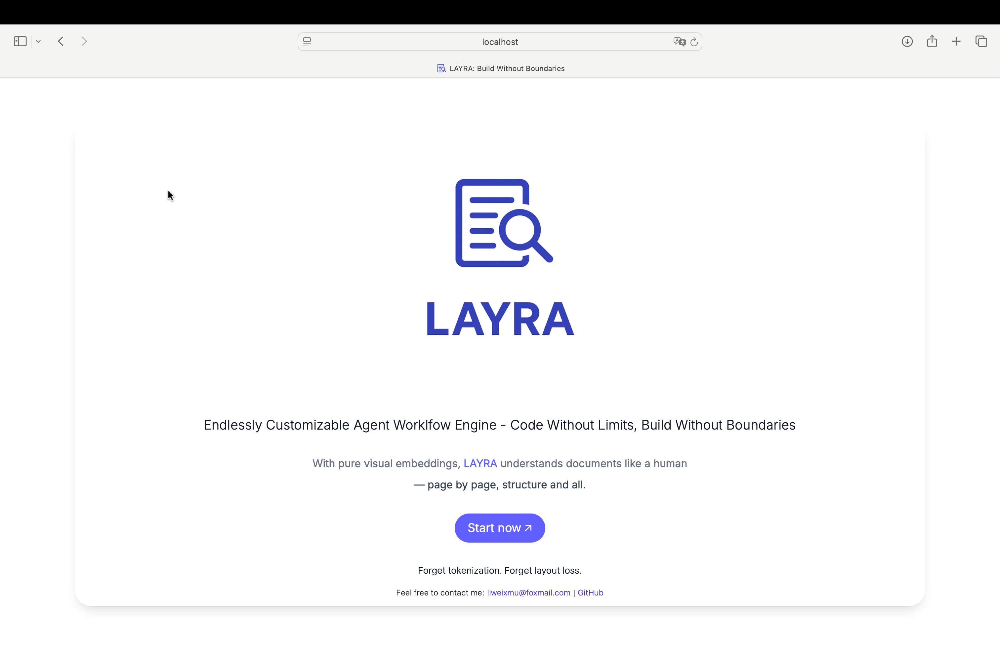
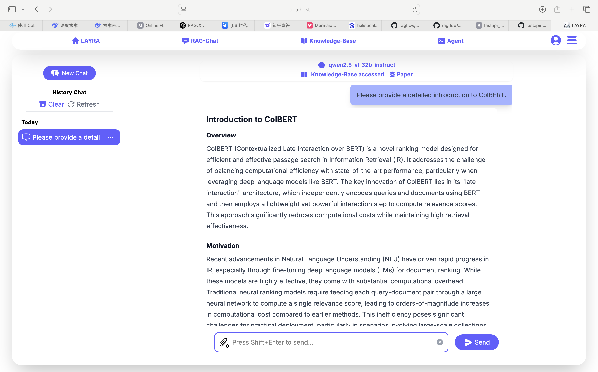

<div align="center">
  
</div>

<p align="center">
  <a href="./README.md">English</a> |
  <a href="./README_zh.md">简体中文</a> 
</p>

# 🌌 LAYRA：超越传统OCR的视觉驱动RAG系统

> **忘记切片，忘记排版丢失。**  
> 通过纯视觉嵌入，LAYRA像人类一样理解文档 ——逐页，按结构阅读。

**LAYRA** 是一款基于**纯视觉嵌入**的下一代检索增强生成（RAG）系统。它将文档视为具有视觉结构的对象，而不是单纯的文本token序列——保留布局、语义和图形元素，如表格、图形和图表。

LAYRA 适用于研究探索和企业部署，具备以下特点：

- 🧑‍💻 **现代前端技术栈**：基于 TypeScript 的 [Next.js 15](https://nextjs.org/blog/next-15) 和 [TailwindCSS 4.0](https://tailwindcss.com)，提供快速、响应式且开发者友好的界面。
- ⚙️ **全异步后端架构**：基于 [FastAPI](https://github.com/fastapi/fastapi)，无缝集成全异步组件，包括 **Redis**、**MySQL**、**MongoDB** 和 **MinIO**，优化高性能数据流和可扩展性。
- 🧠 **视觉驱动的多模态基础**：使用 [Qwen2.5-VL](https://github.com/QwenLM/Qwen2.5-VL) 系列作为当前默认的大语言模型，未来将支持 **GPT-4o**、**Claude**、**Gemini** 和其他多模态模型。
- 🎯 **图像级嵌入**：文档解析和视觉嵌入通过 [Colpali](https://github.com/illuin-tech/colpali) 项目实现，使用 [colqwen2.5](https://huggingface.co/vidore/colqwen2.5-v0.2) 将页面转换为丰富的语义向量，存储在 [Milvus](https://milvus.io/) 中。

> LAYRA 致力于成为**企业级的开箱即用视觉 RAG 平台**，连接非结构化文档理解和多模态 AI。

🚧 **当前加速开发中**:  
首个测试版本现已开放试用，仅支持**PDF文档**。
📚 后续版本将陆续新增对更多文档类型的支持（如Word、PPT、Excel、图片、Markdown等）。  
📈 详见[路线图](#-路线图).

---

## 📚 目录

- [最新更新](#-最新更新)
- [为什么选择 LAYRA？](#-为什么选择-layra)
- [首个可用测试版本](#-首个可用测试版本)
- [系统架构](#-系统架构)
  - [查询流程](#-查询流程)
  - [上传与索引流程](#-上传与索引流程)
- [主要特性](#-主要特性)
- [技术栈](#-技术栈)
- [部署](#-部署)
- [应用场景](#-应用场景)
- [路线图](#-路线图)
- [贡献](#-贡献)
- [许可证](#-许可证)
- [联系方式](#-联系方式)

---

## 🚀 最新更新

- **(2025.4.6) 首个试用版本现已发布**:  
  LAYRA 的第一个可测试版本已经上线！用户可以上传 PDF 文档，提出问题，并获得保留排版信息的答案。我们很高兴看到这个功能在实际文档理解中的应用。

- **当前功能**:  
  - 支持 PDF 批量上传和解析功能
  - 基于视觉的检索增强生成 (RAG) 系统，支持查询文档内容
  - 后端已全面优化，支持高效的数据流动，采用 **FastAPI**、**Milvus**、**Redis**、**MongoDB** 和 **MinIO**

- **即将推出的功能**:  
  - 更多文档格式的支持（例如 Word、PPT、Excel 和图像）
  - 支持更多的大型模型，包括 **GPT-4o** 和 **Claude**
  - 引入智能 Agent 进行多跳推理与高级文档分析

敬请关注未来更新和功能发布！

---

## ❓ 为什么选择 LAYRA？

大多数 RAG 系统依赖 OCR 或基于文本的解析来处理文档，但这些方法存在以下问题：

- ❌ **失去文档布局排版**（列、表格、层级结构崩溃）
- ❌ **无法处理非文本视觉元素**（图表、图形、图片等）
- ❌ **OCR 分割导致语义断裂**

**LAYRA 改变了这一切。**

> 🔍 它像人类一样，从整体上理解文档的每一页。

通过使用**纯视觉嵌入**，LAYRA 保留了：
- ✅ 布局结构（标题、列表、段落）
- ✅ 表格完整性（行、列、合并单元格）
- ✅ 视觉元素（图形、图表、手写）
- ✅ 布局与内容之间的一致性

---

## 🧪 首个可用测试版本

> ✅ **LAYRA 的首个可用版本现已发布！**  
> 上传您的 PDF 文档，提问并接收保留布局的答案。

您现在可以探索首个版本，该版本支持 PDF 上传，并基于文档的视觉布局返回问题答案。

### 截图：

1. **首页 — 获取开始**
   

2. **知识库 — 上传文档并查看文件**
   

3. **互动对话 — 提问并获得布局保留的答案**
   
   

---

## 🧠 系统架构

LAYRA 的管道设计为 **异步优先**，**视觉驱动** 和 **可扩展的文档检索与生成**。

### 🔍 查询流程
查询经过嵌入 → 向量检索 → 答案生成：


### 📤 上传与索引流程
PDF 被解析为图像，并通过 ColQwen2.5 进行视觉嵌入，元数据和文件存储在适当的数据库中：


---

## ✨ 主要特性

| 特性 | 描述 |
|--------|-------------|
| 🧠 **视觉驱动的 RAG** | 无需依赖 OCR，直接嵌入原始文档图像 |
| 🧾 **布局保留的问答** | 理解表格、标题和多列布局 |
| 📊 **支持视觉内容** | 解析并处理图表、图形等非文本内容 |
| ⚙️ **异步文档解析** | 通过 Kafka 进行后台文档处理 |
| 🔍 **快速向量检索** | 使用 Milvus 提供可扩展的密集向量检索 |
| 🤖 **灵活的大语言模型后端** | 支持 Qwen2.5-VL 系列，并可扩展至 GPT-4o、Claude 3 等 |
| 🌐 **现代 Web UI** | 基于 Next.js + TypeScript + TailwindCSS + Zustand 构建 |

---

## 🧰 技术栈

**前端**:  
- `Next.js`, `TypeScript`, `TailwindCSS`, `Zustand`

**后端**:  
- `FastAPI`, `Kafka`, `Redis`, `MySQL`, `MongoDB`, `MinIO`, `Milvus`

**模型底座**:  
- Embedding: `colqwen2.5-v0.2`  
- LLM Serving: `VLM  (Qwen2.5-VL series)`

---

## 🚀 部署

### ▶️ 本地开发

```bash
# 克隆仓库
git clone https://github.com/liweiphys/layra.git
cd layra

# 设置数据库连接参数与 FastAPI 配置
vim .env
vim web/.env.local 
vim gunicorn_config.py
# 或者直接使用默认设置

# 使用 Docker Compose 启动 Milvus、Redis、MongoDB、Kafka 和 MinIO。
cd docker
sudo docker-compose -f milvus-standalone-docker-compose.yml -f docker-compose.yml up -d

# 返回项目根目录
cd ../

# 安装 Python 3.10.6 并设置虚拟环境（可选）
# python -m venv venv && source venv/bin/activate
# 或使用 conda 安装
conda create --name layra python=3.10
conda activate layra

# 安装依赖
pip install -r requirements.txt

# 下载大模型权重
# ⚠️ 若未安装 Git LFS，请先执行：
git lfs install

# 下载原始权重 
# git clone https://huggingface.co/vidore/colqwen2.5-base
# 中国用户可使用镜像：
git clone https://hf-mirror.com/vidore/colqwen2.5-base

# 下载微调权重
# git clone https://huggingface.co/vidore/colqwen2.5-v0.2
# 中国用户可使用镜像:
git clone https://hf-mirror.com/vidore/colqwen2.5-v0.2

# 修改 adapter_config.json 中的 base_model_name_or_path 路径
base_model_name_or_path="colqwen2.5-base下载路径"
# 设置为 colqwen2.5-base 下载路径

# 修改 .env 文件，修改以下配置项
COLBERT_MODEL_PATH="colqwen2.5-v0.2下载路径"

# Mysql 数据库初始化
alembic init migrations
cp env.py migrations
alembic revision --autogenerate -m "Init Mysql"
alembic upgrade head

# 使用 Gunicorn 启动后端服务
gunicorn -c gunicorn_config.py app.main:app
# 访问地址：http://localhost:8000

# 启动 ColBERT 服务（向量化模型服务器）
python model_server.py

# 开发前端
cd web
npm install
npm run dev 
# http://localhost:3000

# 或者构建前端（推荐）
# cd web
# npm install
# npm run build
# npm start  # http://localhost:3000
```

> 🧪 注意：Milvus、Redis、MongoDB、Kafka 和 MinIO 需要本地运行或通过 Docker 启动。

#### 🎉 尽情享受吧！
现在一切都已启动并运行，尽情享受使用 Layra 的过程吧！🚀

### ▶️ 未来部署选项

未来，我们将支持包括 Docker、Kubernetes (K8s) 和其他容器化环境在内的多种部署方式。详细信息将在这些部署选项可用时提供。

---

## 📚 应用场景

- 🧾 **智能文档问答**: 合同、发票、扫描版报告
- 🏛 **政策/法律文件**: 结构复杂的PDF文档解析
- 🏭 **工业手册**: 不便于OCR处理的版式/表格/流程图
- 📈 **可视化分析**: 基于图表数据的趋势挖掘

---

## 📦 路线图

- [x] 知识库 PDF 批量上传和解析功能
- [x] 基于 RAG 的对话系统，支持查询和回答
- [x] OpenAI 兼容接口接入（ollama、sglang、vllm） 
- [ ] 代码架构和模块化优化，以实现更好的可扩展性
- [ ] 支持更多视觉或多模态大模型
- [ ] 扩展文档格式支持（如 Word、PPT、Excel）
- [ ] 集成智能 Agent，用于多跳推理
- [ ] 接入知识图谱体系  
- [ ] 支持 Docker Compose 快速部署    
- [ ] 开放知识库 API 接口  

---

## 🤝 贡献

欢迎贡献！如果您想帮助我们，请随时提交问题或拉取请求。
我们正在创建 CONTRIBUTING.md 文件，其中将提供代码贡献、问题报告和最佳实践的指导，敬请期待！

---

## 📄 许可证

本项目采用 **Apache 2.0** 许可证。更多详情请查看 [LICENSE](./LICENSE) 文件。

---

## 📫 联系方式

**liweiphys**  
📧 liweixmu@foxmail.com  
🐙 [github.com/liweiphys/layra](https://github.com/liweiphys/layra)  
📺 Bilibili：Biggestbiaoge（主页有LAYRA的视频介绍）  
💼 *目前开放求职中，欢迎HR联系！*

---

> _LAYRA 看到 OCR 无法识别的内容，它像我们一样理解文档——从视觉、结构到整体理解。_