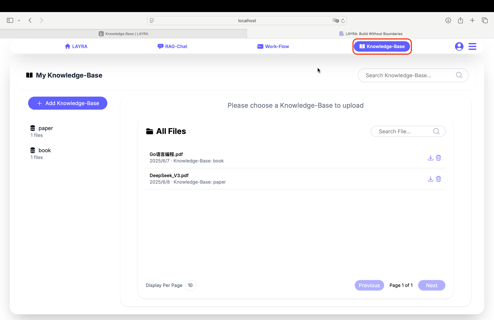
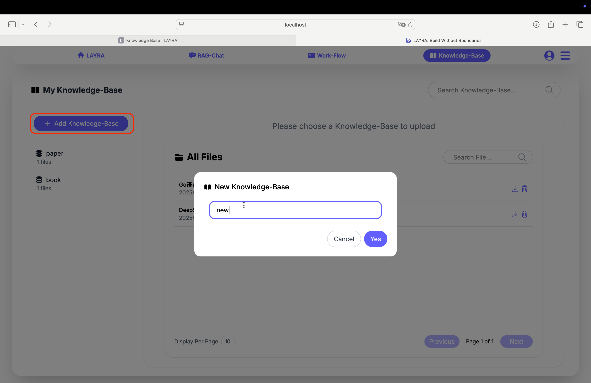
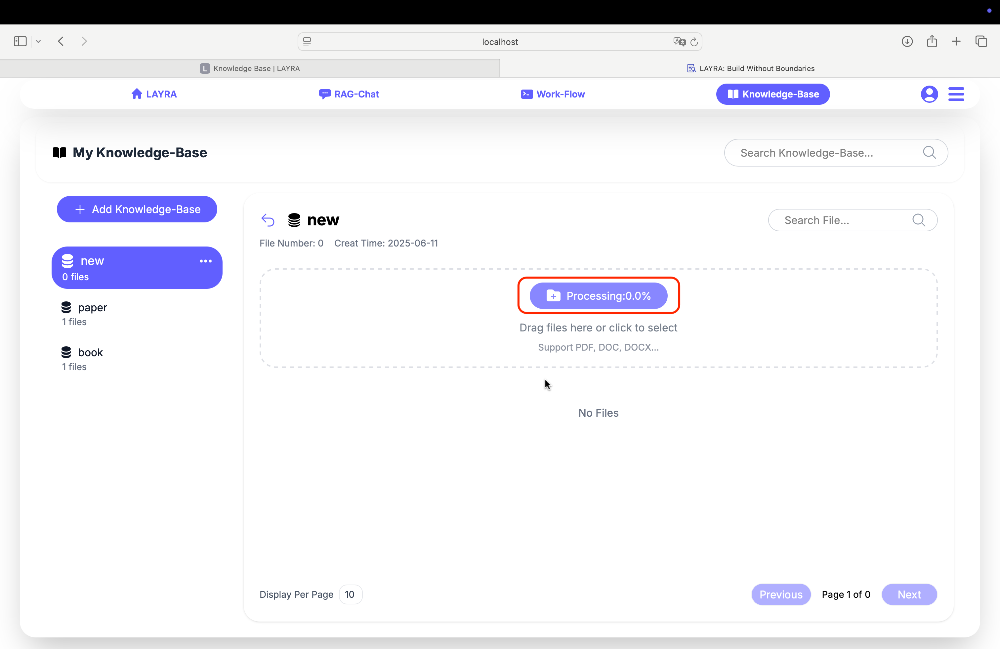
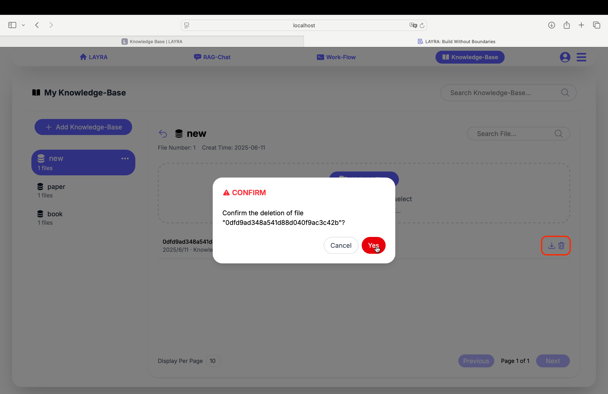

# Knowledge Base

LAYRA's RAG system provides **visual-native document understanding** with layout-aware retrieval and processing. To enable RAG functionality, you need to create a knowledge base and upload documents before starting conversations in the RAG-CHAT module. This guide covers how to create and manage your knowledge base.

:::tip Use External Knowledge Bases
LAYRA also supports calling **external knowledge bases** via the MCP protocol or Python-based web requests. For instance, the **RAGFLOW** knowledge base can be accessed using the MCP protocol. However, this retrieval method is only available within *[Workflows](./work-flow/nodes/llm-node)* and cannot be used in the RAG-CHAT.
:::

---

## Create a Knowledge Base

### Step 1: Select the Knowledge Base Module
When no knowledge base is selected, the main area on the right displays all uploaded documents from all knowledge bases. You can search for specific documents using the search box, which supports fuzzy search.

---

### Step 2: Create Your First Knowledge Base
Click **Add Knowledge Base** in the upper left corner to create your first knowledge base.

:::tip NOTE
You can rename or delete a knowledge base by clicking the three-dot menu button next to the knowledge base name in the left sidebar.
:::

:::danger WARNING
Deleted knowledge bases cannot be recovered.
:::

---

## Uploading Documents

LAYRA supports **50+ file formats** including PDF, DOCX, PPTX, DOC, etc. To upload:

1. Select your newly created knowledge base to access its document page
2. Upload files in batches by either:
   - Clicking the **Upload Files** button (supports multi-file selection), or
   - Dragging-and-dropping multiple files into the upload zone

:::important NOTE
The system will process all files **in parallel**, with the **maximum number of concurrent instances** determined by the `UNOSERVER_INSTANCES` setting in the `.env` file **and** the available GPU resources. Progress will be displayed as a percentage.

The progress percentage is calculated by **file count**. For example:
- 4 documents: 0% → 25% → 50% → 75% → 100%
- 1 document: 0% → 100%
:::

:::tip NOTE
You can search for documents within the current knowledge base using the search box, which supports fuzzy search.
:::

---

## Downloading and Deleting Documents

Click the **Download** or **Delete** icons to perform corresponding actions.

:::danger WARNING
Deleted files cannot be recovered.
:::

---

## Visual RAG Features

Unlike traditional text-only RAG systems, LAYRA preserves:

- ✅ **Layout structure** (headers, columns, sections)
- ✅ **Visual elements** (tables, charts, diagrams)

:::tip BEST PRACTICES
Regularly remove outdated documents and update with new versions.
:::

---

## Next Steps  
Try visual Q&A in **Chat**   