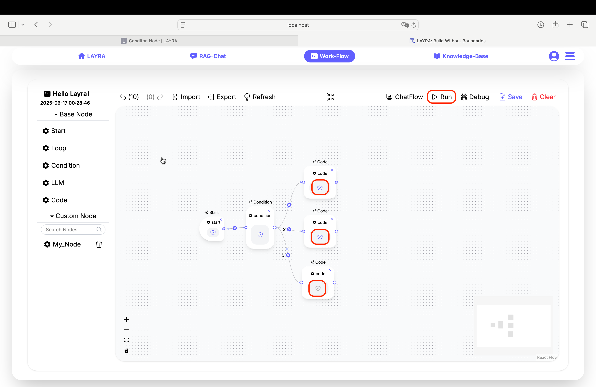
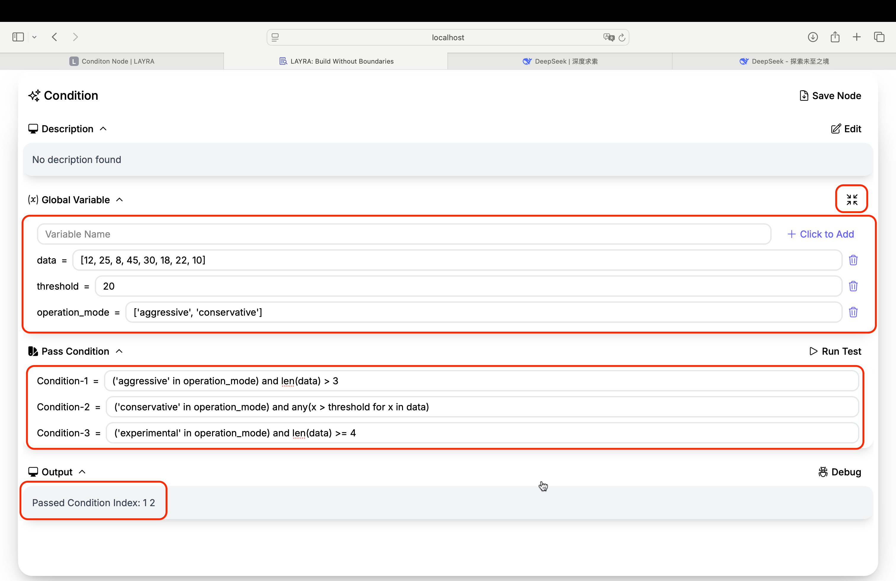

# Condition Node

In this section, we'll explore the **Condition Node**, which functions similarly to `if - else if - else` conditional statements in programming languages.

---

## Basic Conditional Logic

Remember the first step in creating a workflow? Start by adding a Start node. Then, as the second step, add a Condition node. To demonstrate conditional branching, we'll add three additional Code nodes to visualize execution paths.

When connecting the Condition node's outputs to Code node inputs, you'll notice **numbered indicators** on the connection lines. These **unique IDs** identify each branch path.


Select the Condition node to reveal the configuration panel. Compared to the Start node, you'll see a new **Pass Condition** section alongside the familiar **Description**, **Global Variable**, and **Output** settings (covered in the **[Node Introduction](./node-intro)** chapter).

The **Run Test** button next to **Pass Condition** enables isolated node testing - independent of other workflow nodes.

:::tip DEBUGGING BENEFIT
Node-level testing eliminates the need for full workflow executions during development.
:::

The **Pass Condition** section displays input fields (Condition-1, Condition-2, etc.) corresponding to your branch **IDs**. These fields accept **Python expressions** where:
- `True` → Branch **activates**
- `False` → Branch **skips**

### Example Setup
1. Create global variables:  
   `count_1=1`, `count_2=2`, `count_3=3`, `max_count=2`
2. Configure branch conditions:  
```python
# Branch 1
count_1 <= max_count

# Branch 2
count_2 <= max_count

# Branch 3
count_3 <= max_count
```

Click **Run Test** to validate:  
```plaintext
Passed Condition Index: 1 2
```
This indicates only branches 1 and 2 activate since `count_3=3 > max_count=2`.

---

### Workflow Execution
Click the canvas **Run** button to execute the workflow. Only Code nodes connected to branches 1 and 2 turn **blue**, confirming successful conditional execution.



:::important NODE STATUS INDICATORS
- Gray ✓: Not executed  
- Blue ✓: Success  
- Red ❗: Error  
- Red ⏸: Paused (debug breakpoint or waiting for LLM input)
:::

---

## Advanced Conditional Logic

Condition nodes support **complex Python expressions**. Consider this configuration:



:::tip PRO TIP
Use the **full-screen icon** (next to Global Variables) for editing lengthy code/text.
:::

The three branch conditions above might seem complex, but users with Python knowledge can immediately tell that branches 1 and 2 evaluate to True, while branch 3 is False.

```python
# Branch 1: True
('aggressive' in operation_mode) and len(data) > 3

# Branch 2: True
('conservative' in operation_mode) and any(x > threshold for x in data)

# Branch 3: False
('experimental' in operation_mode) and len(data) >= 4
```
Python features like `list.pop()`, `dict[key]`, and other native operations are fully supported.

---

## Next Steps
Next we'll explore the **Loop Node** for nested iteration - keep going!
