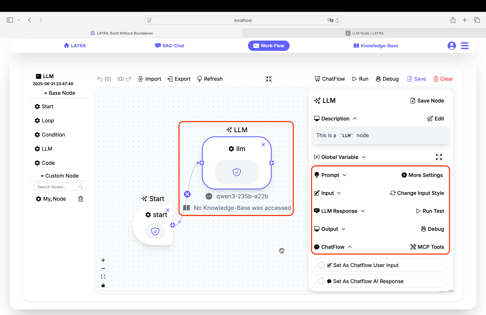
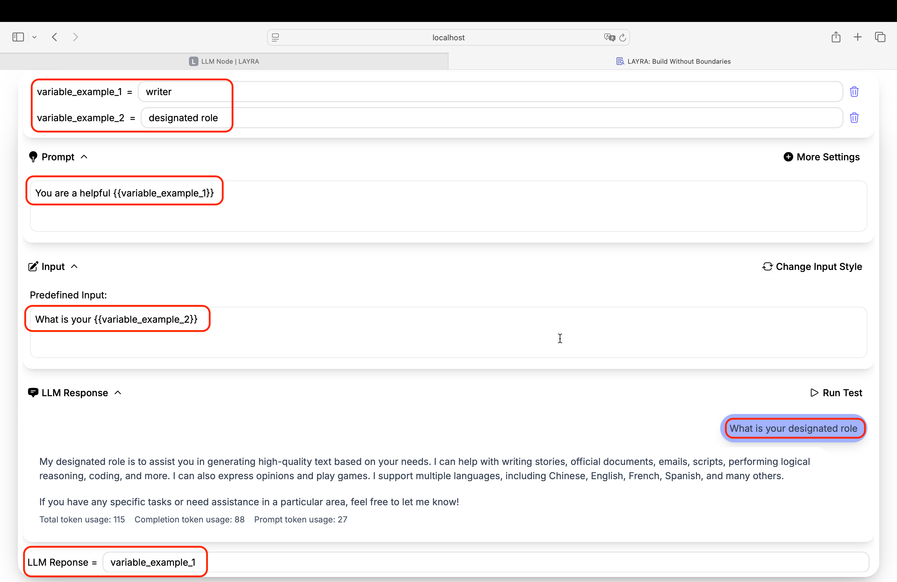
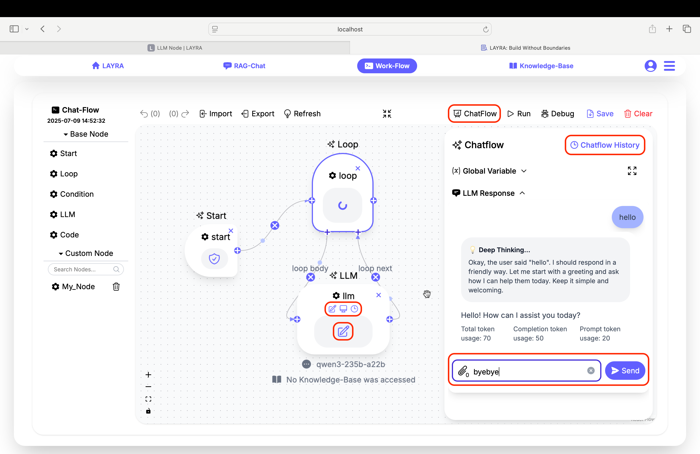
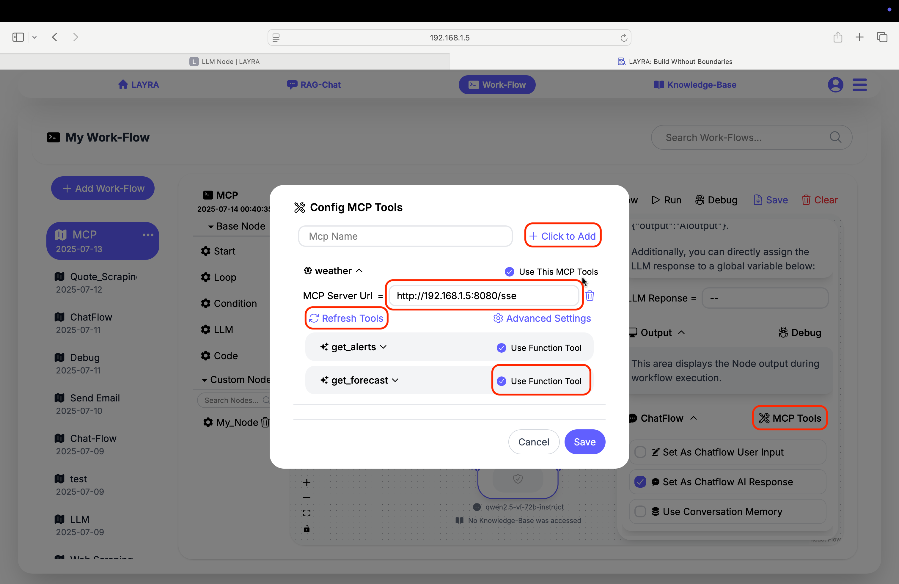
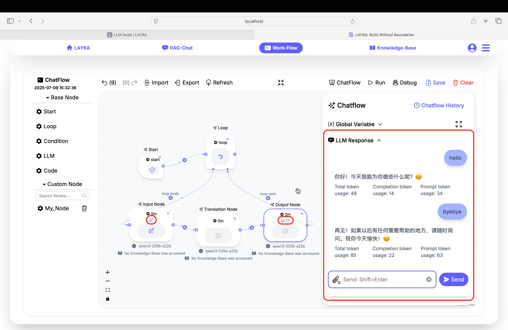
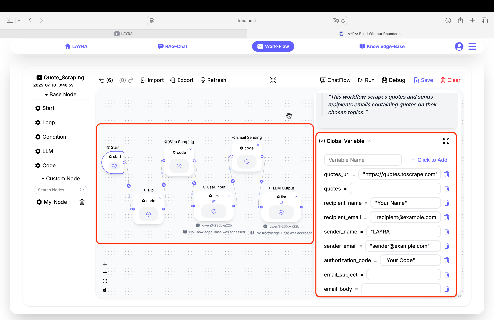
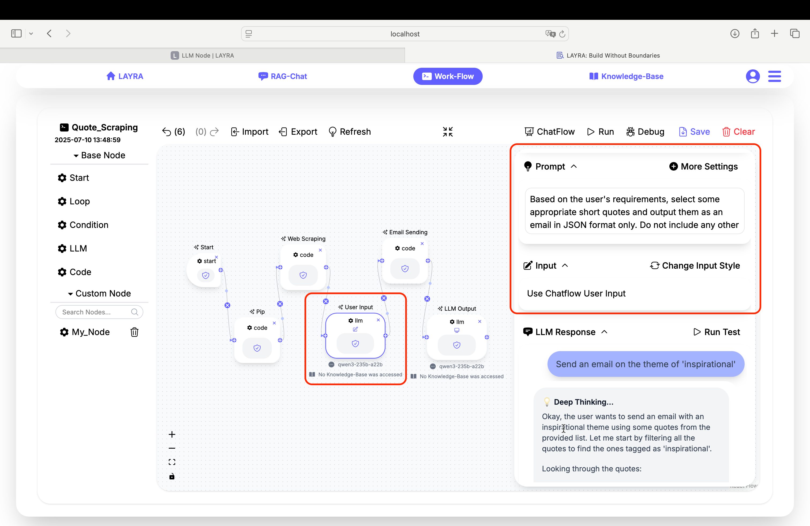
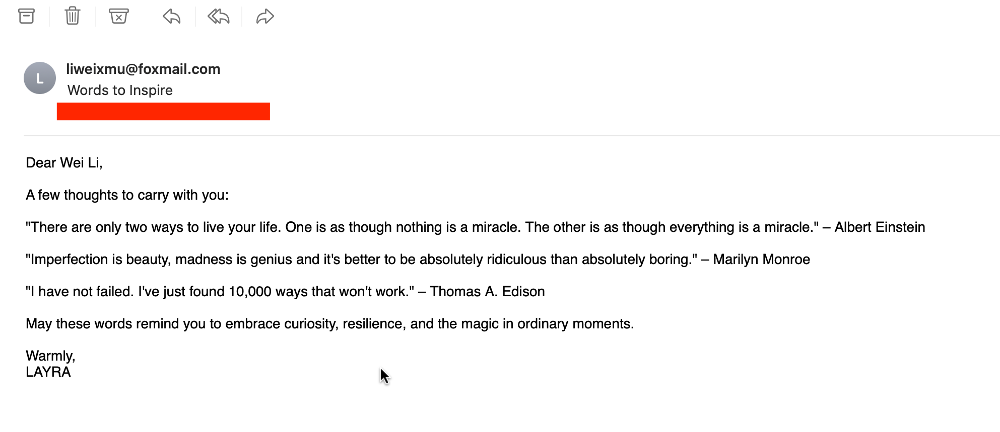

# LLM Node

The LLM Node is the core component for integrating large language models into your workflows. It provides flexible interfaces to configure system prompts, inputs, and outputs while enabling seamless interaction with global variables, knowledge bases (RAG), external function calls (including MCP), and other advanced features.



---

## Core Configuration Sections

### 1. Prompt Configuration

Defines the system prompt guiding the LLM's behavior. Supports dynamic variable insertion using `{{variable}}` syntax.

- **Format**: Plain text with optional variable placeholders
- **Variable Handling**: Automatically replaces `{{variable}}` with values from **Global Variables**
- **Advanced Settings** (via **More Settings**):
  - Model selection
  - LLM parameters (temperature, max tokens, top-P, etc.)
  - Knowledge base RAG integration  
    _Refer to [RAG-Chat](../../RAG-Chat) for implementation details._

### 2. Input Configuration

Determines the LLM's input source with two operational modes:

#### Predefined Input

- Fixed input defined during workflow design
- Supports `{{variable}}` syntax for **Global Variables**
- Executes workflow without user interruption
- Activated via `Change Input Style`

#### ChatFlow User Input

- Pauses workflow execution at this node
- Presents interactive dialog for real-time user input **(Human-In-The-Loop)**
- Activated via `Change Input Style`

### 3. LLM Response

Processes and displays model outputs with these features:

- **Markdown Rendering**: Formatted display including URL/base64 images
- **JSON Extraction**:
  Automatically detects and extracts JSON objects using regex. Supports multiple JSON structures in outputs. Valid JSON pairs with **Global Variables** for assignment.
  ```python
  # Example
  {"variable": "value"} → Updates global variable
  ```
- **Run Test**: Execute node independently
- **Response Assignment**:
  - Dropdown lists all _Global Variables_
  - Assigns full response to selected variable  
    _Works parallel with **JSON Extraction**_



---

### 4. ChatFlow Controls

**The ChatFlow module is essential in LAYRA workflows**, enabling you to interrupt execution at any point for manual input (e.g., activating `human-in-the-loop` for intervention) while selectively displaying LLM outputs and hiding backend processes such as reasoning or text handling.

#### Three checkboxes governing conversation flow:

| Checkbox                        | Function                 | Dependencies                  |
| ------------------------------- | ------------------------ | ----------------------------- |
| **Set As Chatflow User Input**  | Marks node as user input | Auto-enables user input mode  |
| **Set As Chatflow AI Response** | Marks node as AI output  | Required for Memory feature   |
| **Use Conversation Memory**     | Maintains chat history   | Requires AI Response checkbox |

When enabling `User Input`, `AI Response`, `Conversation Memory`, or `MCP Support`, corresponding icons appear on canvas nodes.

- **User Input Nodes**:  
  Enable `User Input` to pause workflow execution and display an interactive input dialog in ChatFlow. Nodes with `Predefined Input` run in the background using preset values. View detailed input/output via the node's `LLM Response` and `Output` panels.

- **AI Response Nodes**:  
  Enable `AI Response` to display model outputs in the ChatFlow dialog. Disabled nodes run in the background – check `LLM Response` and `Output` panels for details.

- **Conversation Memory**:  
  Enable to retain chat history across sessions. Disabling treats each `User Input` as a new conversation.

> Access historical ChatFlow runs via the top-right `Chatflow History` button. This only includes conversations where `User Input`/`AI Response` features were enabled.

:::important CHATFLOW LOGIC  
Each `User Input` node must be followed by a corresponding `AI Response` node to maintain conversational flow. The system will flag errors for:

- Consecutive `User Input` nodes
- Consecutive `AI Response` nodes  
  :::



---

### 5. MCP Support

Click the `MCP Tools` button in the top-right corner of the ChatFlow configuration panel to set up MCP servers. LAYRA supports SSE-streaming MCP services with simple configuration:

1. Enter `MCP Name` and click `Click to Add` to create server
2. Input SSE endpoint URL in `MCP Server Url`
3. Use `Refresh Tools` to load available tools
4. Activate services:
   - Toggle `Use This MCP Tools` for full service activation
   - Check `Use Function Tool` per tool for granular control

Once activated, LLMs automatically invoke tools during conversations. Multiple MCP servers can be configured per LLM node.

:::tip RECOMMENDATION
We recommend disabling the LLM's `thinking mode` when using MCP, as the backend activates built-in reasoning modules during tool invocation.
:::



:::important MCP SERVER LOCAL DEPLOYMENT NOTE  
**When using a locally hosted MCP server:**

1. Set the `MCP Server Url` to your machine's **Internal IP Address** (e.g., `http://192.168.1.5:8000/sse` or `http://10.0.0.2:5000/sse`), **not** `localhost:5000/sse`.
2. **Firewall Configuration:** If you're using a firewall (e.g., `ufw`), allow Docker network access **to** your MCP server port.
3. **Service Binding:** Ensure your MCP service **binds to `0.0.0.0`** (all interfaces), **not** `127.0.0.1` (localhost only).  
   :::

---

## ChatFlow Mechanics

We demonstrate ChatFlow Mechanics through a simple workflow containing three LLM nodes:

1. The first LLM node handles user input
2. The second translates the first node's English output into Chinese
3. The third node outputs the second node's Chinese translation

In the ChatFlow interface, only the user's English input and final Chinese output are visible. The first node's output, third node's input, and the entire second node operate in the background.

### Basic ChatFlow Example


- Only input/output nodes appear in the ChatFlow UI
- Intermediate processing remains hidden

### Conversation Memory Setup

- **Requirements**:

  - Paired input/output nodes
  - "Use Conversation Memory" enabled on output nodes

- **Validation**:
  - Blocks consecutive input nodes
  - Prevents orphaned output nodes

This example also has the memory feature enabled:



---

## Variable Configuration Guide

### 1. Basic Prompt with Variables

1. Create global variable: `topic = "climate change"`
2. Configure prompt:
   ```markdown
   As a science expert, explain {{topic}} in simple terms.
   ```
3. Set input style: **Predefined Input** (`What are key impacts?`)

### 2. Interactive User Input

1. Enable **Set As Chatflow User Input**
2. Configure prompt:
   ```markdown
   As a travel assistant, always provide helpful responses.
   ```

### 3. Output Capture Methods

#### 3.1 JSON Output Processing

1. Prompt configuration:
   ```json
   Output JSON: {destination, duration, budget}
   Example: {"destination": "Paris", "duration": 7, "budget": 2500}
   ```
2. LLM output:
   ```json
   { "destination": "Kyoto", "duration": 10, "budget": 3200 }
   ```
3. Automatically updates variables in **Global Variables**:
   - `destination = "Kyoto"`
   - `duration = 10`
   - `budget = 3200`

#### 3.2 Manual Assignment

Select variable in `LLM Response=` dropdown → Full response stored

:::warning Error Prevention

- ⚠️ **"Consecutive input nodes without output"**
- ⚠️ **"Output node without preceding input"**
- ⚠️ **"Memory enabled without AI Response designation"**
- ⚠️ **"Using `Predefined Input` without defining content"**  
  :::

---

## Implementation Example: Web Scraping + Email Automation

Let’s walk through a practical example of combining **LLM nodes** with **code nodes** in a workflow to create a simple automation: scraping quotes from a website, filtering them by a user-specified theme using a large language model, and sending the selected quotes via email.

This example involves **four functional nodes** plus an additional `code` node to install required pip dependencies.

In this workflow, there is a single human intervention step: specifying the desired quote theme before the LLM generates the email content. Therefore:

- The **email generation node** needs to enable the `User Input` feature.
- Before that, we add a `code` node to scrape a large number of quotes for the LLM to filter.
- After the LLM processes the data, another `code` node sends the email.
- Finally, we add an LLM output node with `AI Response` enabled at the end of the workflow to display the sent email content directly in the Chatflow for improved user experience.



### 1. Global Variable Configuration

As shown above, first define all necessary **Global Variables**:

Before proceeding, you must authorize LAYRA to send emails using an `Authorization Code`. Refer to the [Code Node Section](./code-node) for instructions, or ask the LLM directly for guidance.

```python
quotes_url = "https://quotes.toscrape.com" # The website to scrape quotes from

quotes = "" # Initially empty; will be populated by the scraping node

recipient_name = "Your Name" # Replace with the recipient's name

recipient_email = "recipient@example.com" # Replace with the recipient's email

sender_name = "LAYRA" # Replace with the sender's name

sender_email = "sender@example.com" # Replace with the sender's email

authorization_code = "Your Code" # Replace with the sender's Authorization Code

email_subject = "" # Initially empty; generated by the LLM

email_body = "" # Initially empty; generated by the LLM
```

:::tip Best Practice
Often, you do not need to define all `Global Variables` at the start. Instead, add or remove variables as your workflow logic evolves.
:::

### 2. Node Configuration

#### 1. Pip Dependencies Node

Modify the `Pip Dependencies` field to include:

```python
beautifulsoup4
requests == 2.26.0
```

If you are located in China and need to accelerate downloads, set a pip mirror:

```python
Mirror Url = https://pypi.tuna.tsinghua.edu.cn/simple
```


:::tip Persisting Mirrors
Check `Commit Runtime Environment` to persist your pip mirror and dependencies, avoiding the need for a separate pip installation node in future runs.
:::

#### 2. Web Scraping Node

Replace the `Code Editor` content with the following code. This script scrapes **only the first two pages**, accepts `quotes_url` as input, and stores the scraped quotes into the `quotes` variable:

```python
import requests
from bs4 import BeautifulSoup
import json

def scrape_quotes_toscrape(base_url):
    scraped_quotes = []

    # Scrape only the first two pages
    for page_num in range(1, 3):
        url = f"{base_url}/page/{page_num}/"
        print(f"Scraping page {page_num}: {url}  ")

        # Send HTTP request
        response = requests.get(url)

        # Check response status
        if response.status_code != 200:
            print(f"Failed to scrape page {page_num}. Status code: {response.status_code}  ")
            continue

        # Parse HTML content
        soup = BeautifulSoup(response.text, 'html.parser')

        # Find all quote blocks
        quotes = soup.select('div.quote')

        # Extract information from each quote
        for quote in quotes:
            text = quote.select_one('span.text').text.strip()
            author = quote.select_one('small.author').text.strip()
            tags = [tag.text for tag in quote.select('a.tag')]

            scraped_quotes.append({
                'quote': text,
                'author': author,
                'tags': tags,
                'page': page_num
            })

        print(f"Page {page_num} scraped successfully. Found {len(quotes)} quotes\n")

    # Print summary
    print(f"Total quotes scraped: {len(scraped_quotes)}  ")
    return scraped_quotes

# Function execution
quotes_data = scrape_quotes_toscrape(quotes_url)

for i, item in enumerate(quotes_data):
    quotes += f"> {i}. {item['quote']}  \n"
    quotes += f"   - **Author**: {item['author']}  \n"
    quotes += f"   - **Tags**: {', '.join(item['tags'])}  \n"
    quotes += f"   - **Page**: {item['page']}\n  "

# Display sample output
print("\n### Sample quotes:  ")
for i, item in enumerate(quotes_data[:5], 1):
    print(f"> {i}. {item['quote']}  ")
    print(f"   - **Author**: {item['author']}  ")
    print(f"   - **Tags**: {', '.join(item['tags'])}  ")
    print(f"   - **Page**: {item['page']}\n  ")

```


#### 3. User Input & Email Generation Node

Set the LLM prompt to:

```bash
Based on the user's requirements, select some appropriate short quotes and output them as an email in JSON format only. Do not include any other information. The output format should be: {"email_subject": email_subject_output, "email_body": email_body_output}. The recipient is: {{recipient_name}}, and the sender is: {{sender_name}}.
 Here are all the quotes information:
{{quotes}}
```

This ensures the LLM outputs a valid JSON containing `email_subject` and `email_body`, which LAYRA will parse and assign to the corresponding **Global Variables**.

**Important:** Enable `Use Chatflow User Input` by checking the `Set As Chatflow User Input` box to accept user input in this node.



#### 4. Email Sending Node

Replace the `Code Editor` content with the following code to send the generated email using the specified SMTP server.

:::important SMTP Server Configuration
Replace the SMTP server address with your own provider. The example below uses Foxmail.
:::

```python
import smtplib, traceback
from email.mime.text import MIMEText
from email.mime.multipart import MIMEMultipart
from email.utils import formatdate

def send_email():
    server = None
    try:
        # ===== Email Content Setup =====
        msg = MIMEMultipart()
        msg['From'] = sender_email  # Replace with sender email
        msg['To'] = recipient_email  # Replace with recipient email
        msg['Subject'] = email_subject  # Updated subject
        msg['Date'] = formatdate(localtime=True)  # Add date header

        # Add email body
        body = MIMEText(email_body, 'plain', 'utf-8')  # Updated content
        msg.attach(body)

        # ===== Establish SSL Connection =====
        server = smtplib.SMTP_SSL('smtp.qq.com', 465)  # Replace with SMTP server
        server.login(sender_email, authorization_code)  # Use authorization code

        # Send email
        server.sendmail(msg['From'], [msg['To']], msg.as_string())
        print("Email sent successfully")

    except Exception as e:
        print(f"Email sending failed: {e}")
        print("Exception traceback:\n", traceback.format_exc())

    finally:
        # Safely close connection, ignore quit errors
        if server:
            try:
                server.quit()  # Attempt graceful quit
            except smtplib.SMTPServerDisconnected:
                # Server already disconnected, no action needed
                pass
            except Exception as e:
                print(f"Non-critical error during connection close: {e}")

# Execute email sending
send_email()

```


#### 5. LLM Output Node

This final node simply displays the generated email body to the user.

Set `Predefined Input` to:

```bash
Output the following content exactly, without including anything else and without any processing:
{{email_body}}
```

Ensure `Set As Chatflow AI Response` is checked so Chatflow displays the email content properly.


### 3. Running the Workflow

Now click **Run** to execute your workflow. In the Chatflow input box, enter a command like:

```bash
Send an email on the theme of 'inspirational'
```

If everything works correctly, your recipient will receive an inspirational email crafted by LAYRA. May these small automations bring you motivation and energy in your daily learning and work.



---

## Next Steps

You have now mastered how to use all node types in your workflows. The final chapter will cover workflow management features including **debugging, import/export, and more**. You’re almost at the finish line – keep moving forward!

> **Coming Soon**: Explore the [Template Gallery](../template-gallery) for prebuilt automation solutions!
